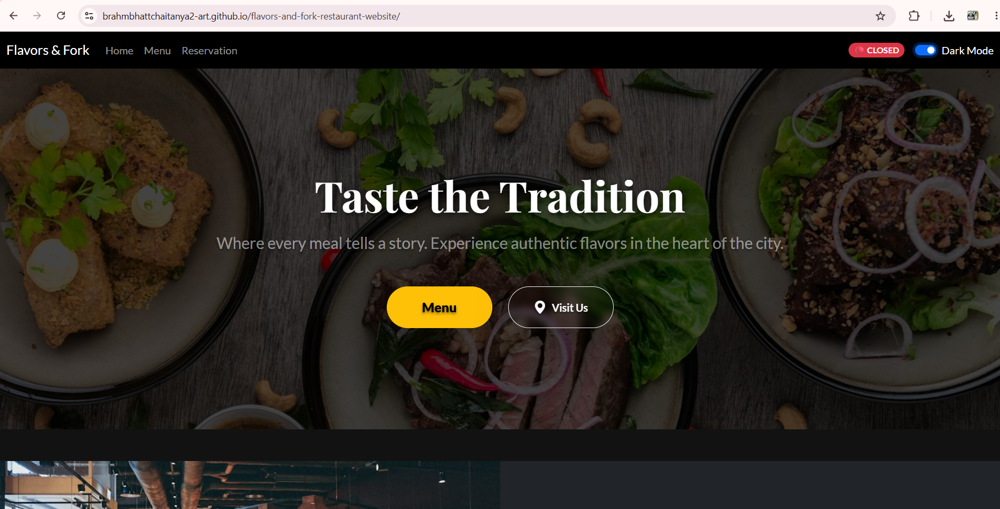
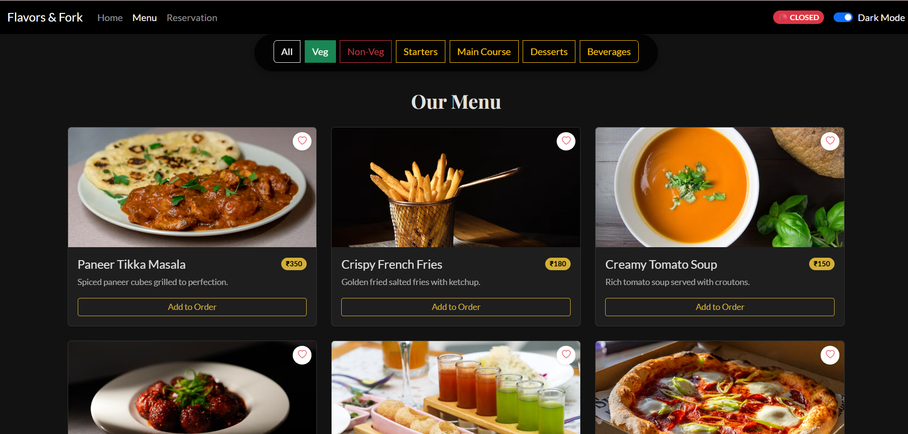
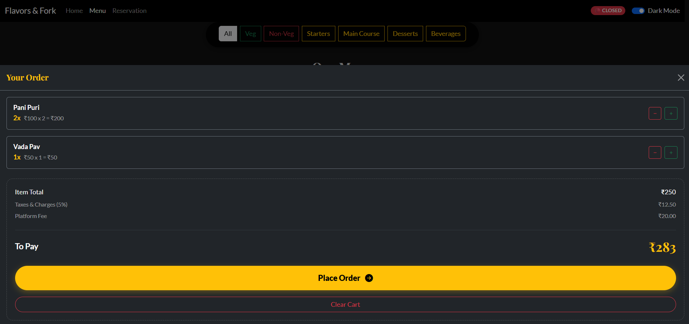
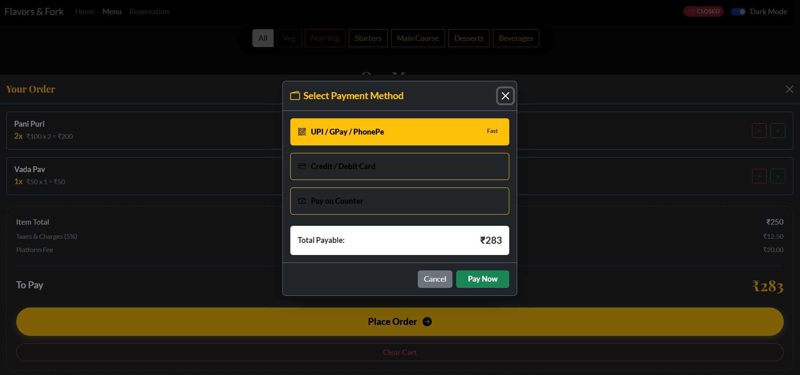
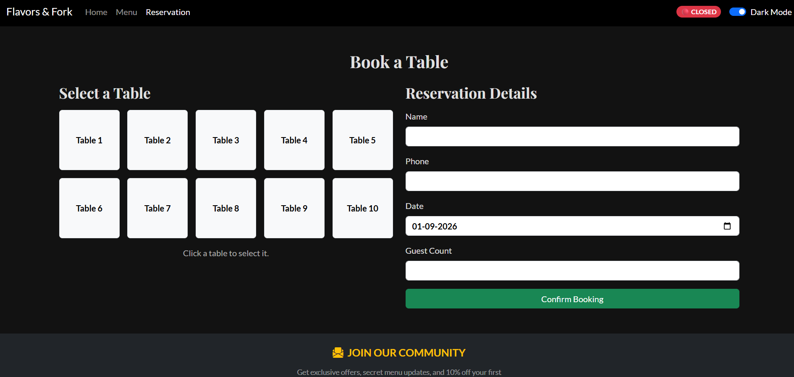

# 🍽️ Flavors & Fork

<p align="center">
  <strong>A modern, responsive and interactive restaurant web application built using HTML, CSS, Bootstrap and Vanilla JavaScript.</strong>
</p>

<p align="center">
  <a href="https://brahmbhattchaitanya2-art.github.io/flavors-and-fork-restaurant-website/">
    
  </a>
  <a href="https://github.com/brahmbhattchaitanya2-art/flavors-and-fork-restaurant-website">
    
  </a>
</p>

---

## 📖 About the Project

**Flavors & Fork** is an interactive frontend restaurant web application developed as an **FSD-I (Full Stack Development-I) academic project** using HTML5, CSS3, Bootstrap 5 and Vanilla JavaScript.

The project provides a modern restaurant experience where users can explore food items, filter the menu, add dishes to an order, manage quantities, calculate the bill, simulate payment and reserve restaurant tables.

The website also includes several interactive UI/UX features such as Dark Mode, Favorites, live restaurant status, image carousel, FAQ accordion, Google Maps integration, newsletter validation and browser Local Storage.

The project focuses on creating a responsive and application-like experience without using a backend server.

---

## ✨ Key Features

### 🏠 Home Page

The Home page provides a modern landing experience for restaurant visitors.

- Responsive navigation bar
- Premium restaurant hero section
- Restaurant introduction
- Menu and Visit Us buttons
- Restaurant feature cards
- Interactive Bootstrap carousel
- Restaurant ambience showcase
- FAQ accordion
- Contact and location section
- Embedded Google Maps
- Newsletter subscription
- Responsive footer
- Back-to-top button

---

## 🍕 Dynamic Food Menu

The menu is dynamically managed using JavaScript.

Users can explore different food items with:

- Food image
- Food name
- Description
- Price
- Category
- Veg / Non-Veg type
- Add to Order controls
- Favorite option

### Menu Filters

Users can instantly filter food items by:

- All
- Veg
- Non-Veg
- Starters
- Main Course
- Desserts
- Beverages

Filtering happens dynamically without reloading the page.

---

## 🛒 Smart Cart System

The website includes an interactive cart system that allows users to build their order.

### Cart Features

- Add food items to cart
- Increase quantity
- Decrease quantity
- Remove items automatically when quantity reaches zero
- Display total number of selected items
- Dynamic subtotal calculation
- Tax calculation
- Platform / service fee
- Grand total calculation
- Clear entire cart
- Responsive Offcanvas cart drawer

The quantity controls are updated using **targeted DOM manipulation**, meaning only the selected item's button area changes instead of reloading the complete food menu.

This provides a smoother and faster user experience.

---

## 💰 Dynamic Bill Calculation

The application automatically calculates the order bill.

The bill contains:

```text
Item Total
     +
Taxes & Charges
     +
Platform Fee
     =
Final Payable Amount
```

The total changes instantly whenever users add or remove food items.

---

## 💳 Payment Simulation

Flavors & Fork includes a frontend payment simulation to demonstrate the checkout process.

### Available Payment Options

- UPI / GPay / PhonePe
- Credit / Debit Card
- Pay on Counter

### Payment Features

- Dynamic payable amount
- Payment method selection
- Processing spinner
- Simulated processing delay
- Random transaction ID
- Random order/token ID
- Payment success confirmation
- Pay-on-counter token generation
- Automatic cart reset after successful payment

> **Note:** The payment system is created only for project demonstration purposes. No real financial transaction is performed.

---

## 📅 Smart Table Reservation

The Reservation page allows users to select and reserve restaurant tables visually.

### Reservation Features

- Interactive table selector
- 10 restaurant tables
- Responsive table grid
- Customer name input
- Phone number input
- Date selection
- Guest count
- Table selection validation
- Past-date prevention
- Booking confirmation
- Date-specific table availability
- Booked table indication
- Duplicate booking prevention

---

## 🪑 Date-Specific Table Booking

One of the important features of the reservation system is **date-specific booking**.

If a table is booked on one date, it can still remain available on another date.

For example:

```json
{
  "2026-09-10": ["1", "4"],
  "2026-09-11": ["2", "5"]
}
```

This means:

```text
10 September
Table 1 → Booked
Table 4 → Booked

11 September
Table 2 → Booked
Table 5 → Booked
```

The table availability automatically updates whenever the user selects another date.

---

## 💾 Local Storage

Browser **Local Storage** is used to store selected information directly inside the user's browser.

It is used for features such as:

- Table reservation data
- Favorite food items
- Dark Mode preference

This allows selected information to remain available even after refreshing the page.

> Local Storage is browser-based storage and is not a replacement for a real server-side database.

---

## ❤️ Favorites System

Users can save their favorite food items using the heart icon.

### Features

- Add food to Favorites
- Remove food from Favorites
- Filled heart for selected items
- Instant visual updates
- Favorites remain saved after browser refresh

Favorites are stored using Local Storage.

---

## 🌙 Dark Mode

The website supports both Light Mode and Dark Mode.

Users can switch between themes using the theme toggle available in the navigation bar.

The selected theme is stored using Local Storage, allowing the website to remember the user's preference after refreshing the page.

---

## 🟢 Live Restaurant Status

The navigation bar automatically shows whether the restaurant is currently open or closed.

The website can display:

```text
🟢 OPEN NOW
```

or

```text
🔴 CLOSED
```

JavaScript uses the current local time and compares it with the configured restaurant opening hours.

---

## 🎠 Restaurant Ambience Carousel

The Home page contains an interactive Bootstrap carousel displaying different restaurant environments.

Examples include:

- Grand Dining Hall
- Lounge
- Evening Ambience

The carousel automatically changes slides and also allows manual navigation.

---

## ❓ Frequently Asked Questions

A Bootstrap Accordion is used for the FAQ section.

Users can expand individual questions without displaying all information at once.

This keeps the Home page clean while still providing useful restaurant information.

---

## 📍 Google Maps Integration

The Visit Us section contains an embedded Google Map.

It helps users locate the restaurant directly from the website.

The map is responsive and automatically adjusts to different screen sizes.

---

## 📩 Newsletter Validation

The website includes a newsletter subscription form.

JavaScript and Regular Expressions are used to validate the entered email address.

Example:

```text
hello
```

Result:

```text
❌ Invalid email format
```

Valid example:

```text
guest@example.com
```

Result:

```text
✅ Subscribed!
```

---

## ⬆️ Back to Top

A floating Back-to-Top button appears after the user scrolls down the page.

Clicking the button smoothly takes the user back to the top.

This improves navigation on longer pages.

---

## 📱 Responsive Design

Flavors & Fork is designed to work across different screen sizes.

Supported layouts include:

- 💻 Desktop
- 💻 Laptop
- 📱 Tablet
- 📱 Mobile

Responsive design is implemented using:

- Bootstrap Grid
- CSS Grid
- Flexbox
- Media Queries
- Responsive Bootstrap utilities

---

## 🛠️ Technologies Used

| Technology | Purpose |
|---|---|
| HTML5 | Website structure |
| CSS3 | Styling and animations |
| JavaScript | Application logic and interactivity |
| Bootstrap 5 | Responsive layout and components |
| Bootstrap Icons | User interface icons |
| Local Storage | Browser-based data persistence |
| DOM API | Dynamic user interface updates |
| CSS Grid | Reservation table layout |
| Flexbox | Component alignment |
| Google Maps Embed | Restaurant location |
| Regular Expressions | Form and email validation |

---

## 📁 Project Structure

```text
Flavors-and-Fork/
│
├── assets/
│   ├── css/
│   │   └── style.css
│   │
│   └── images/
│
├── data/
│   └── menu.json
│
├── js/
│   ├── config.js
│   └── main.js
│
├── index.html
├── menu.html
├── reservation.html
└── README.md
```

---

## 📄 Pages Overview

### 🏠 `index.html`

The main landing page of the restaurant.

Includes:

- Navbar
- Hero section
- Restaurant information
- Feature cards
- Interior carousel
- FAQ section
- Contact information
- Google Maps
- Newsletter
- Footer

### 🍕 `menu.html`

The interactive restaurant menu.

Includes:

- Food cards
- Category filters
- Veg / Non-Veg filter
- Favorites
- Add to Order
- Quantity controls
- Cart system
- Dynamic bill
- Payment simulation

### 📅 `reservation.html`

The restaurant booking page.

Includes:

- Date selection
- Visual table selection
- 10-table layout
- Booking form
- Guest information
- Booking validation
- Date-specific availability
- Local Storage reservation data
- Booking confirmation

---

## ⚙️ How It Works

### 🍕 Menu Flow

```text
Menu Data
    ↓
JavaScript
    ↓
Generate Food Cards
    ↓
Display Menu
    ↓
User Selects Food
    ↓
Cart Updated
    ↓
Quantity Updated
    ↓
Bill Recalculated
```

### 🛒 Cart Flow

```text
Add to Order
      ↓
Check Cart
      ↓
Item Exists?
   ↙       ↘
 Yes       No
 ↓          ↓
Increase   Add Item
Quantity
   ↘       ↙
   Update Cart
       ↓
Calculate Total
       ↓
Update UI
```

### 📅 Reservation Flow

```text
Select Date
     ↓
Check Local Storage
     ↓
Load Bookings
     ↓
Display Table Availability
     ↓
Select Available Table
     ↓
Enter Booking Details
     ↓
Validate Information
     ↓
Confirm Reservation
     ↓
Save Booking
     ↓
Update Table Status
```

---

## 🚀 Getting Started

Follow these steps to run the project on your computer.

### 1. Clone the Repository

```bash
git clone YOUR_GITHUB_REPOSITORY_URL
```

### 2. Open the Project Folder

```bash
cd flavors-and-fork
```

### 3. Open the Project in VS Code

```bash
code .
```

You can also open the project folder manually using Visual Studio Code.

### 4. Install Live Server

Open the **Extensions** section in Visual Studio Code.

Search for:

```text
Live Server
```

Install the extension.

### 5. Run the Website

Open:

```text
index.html
```

Right-click inside the file and select:

```text
Open with Live Server
```

The website will open automatically in your browser.

Example:

```text
http://127.0.0.1:5500/index.html
```

---

## 🌐 Live Demo

You can explore the deployed version of Flavors & Fork here:

### 🔗 [View Live Website](https://brahmbhattchaitanya2-art.github.io/flavors-and-fork-restaurant-website/)


---

## 📸 Project Screenshots

Screenshots of the project will be added here soon.

### 🏠 Home Page


<p align="center">
  
</p>


### 🍕 Menu Page


<p align="center">
  
</p>


### 🛒 Smart Cart


<p align="center">
  
</p>


### 💳 Payment Interface


<p align="center">
  
</p>


### 📅 Reservation Page


<p align="center">
  
</p>


---

## 🧠 Concepts Demonstrated

This project demonstrates practical knowledge of:

### HTML

- Semantic HTML
- Forms
- Input fields
- Navigation
- Embedded content
- Responsive page structure

### CSS

- CSS Variables
- Flexbox
- CSS Grid
- Media Queries
- Hover Effects
- Animations
- Responsive Design
- Dark Mode
- Parallax backgrounds

### JavaScript

- Variables
- Arrays
- Objects
- Functions
- Conditional Statements
- Loops
- Event Listeners
- Template Literals
- DOM Manipulation
- Form Validation
- Regular Expressions
- Date Handling
- Local Storage
- JSON
- Array Methods

JavaScript methods used include:

```javascript
find()
filter()
forEach()
includes()
push()
```

---

## 🎯 Important JavaScript Features

### Targeted DOM Manipulation

Instead of reloading the entire menu whenever the quantity changes, the website updates only the button controls for the selected food item.

This helps prevent unnecessary UI refreshing and creates a smoother experience.

### State Management

The cart uses a JavaScript array to keep track of selected items and quantities during the current session.

Example:

```javascript
let cart = [];
```

Each selected item can contain information such as:

```javascript
{
  id: 1,
  name: "Paneer Tikka Masala",
  price: 350,
  qty: 2
}
```

### Local Storage Persistence

Persistent browser data is saved using:

```javascript
localStorage.setItem()
```

and retrieved using:

```javascript
localStorage.getItem()
```

Objects and arrays are converted using:

```javascript
JSON.stringify()
```

and:

```javascript
JSON.parse()
```

---

## 🎨 UI/UX Highlights

The project focuses strongly on creating a modern restaurant experience.

UI/UX elements include:

- Dark and Gold visual theme
- Smooth animations
- Responsive navigation
- Hover effects
- Interactive food cards
- Quantity controls
- Floating cart bar
- Offcanvas cart
- Payment modal
- Visual table reservation
- Responsive carousel
- FAQ accordion
- Smooth scrolling
- Dark Mode
- Interactive Favorites

---

## 🔮 Future Improvements

The project can be expanded in the future with:

- Backend API integration
- User authentication
- Real database integration
- Admin dashboard
- Real online payment gateway
- Customer accounts
- Order history
- Real reservation management
- Email confirmation
- SMS booking confirmation
- Online food delivery
- Customer reviews
- Ratings
- Search functionality
- Real-time order tracking

---

## ⚠️ Project Scope

Flavors & Fork is currently a **frontend web application developed for FSD-I**.

It does not use a traditional backend server.

Features such as reservations, favorites and theme preferences use browser Local Storage for persistence.

The payment interface is a simulation created for educational and demonstration purposes and does not process real transactions.

---

## ⭐ Support

If you found this project interesting, consider giving the repository a **⭐ Star**.

It helps support the project and motivates further development.

---

<p align="center">
  <strong>Made with ❤️ using HTML, CSS, Bootstrap & JavaScript</strong>
</p>
